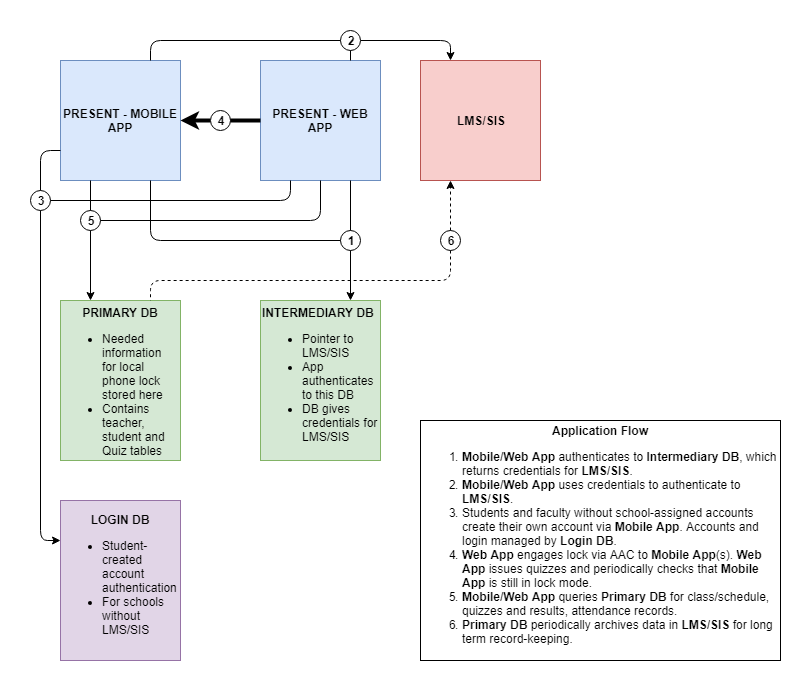

  

<h1 align="center">Present Education</h1>

  <strong>EdTech startup · Portland, OR · 2017–2019</strong> 
  <em>"Take back the classroom."</em>

  <a href="https://elicoon.github.io/present-education/prototype/">Interactive Demo</a> ·
  <a href="docs/retrospective.md">Retrospective</a> ·
  <a href="docs/shutdown-letter.md">Shutdown Letter</a> ·
  <a href="docs/product-features.md">Feature Walkthrough</a>

---

Present was a classroom smartphone management platform — iOS and Android apps that let
teachers temporarily lock distracting native apps on student-owned devices, and run
real-time learning checks, from a single web dashboard.

We incorporated in February 2018. Piloted at Lincoln High School (Portland Public
Schools) with 200+ students. Shipped to the App Store and Google Play in November 2018.
Shut down in August 2019.

This repo is an archive of that work: the designs, the docs, the pitch deck, and
a full retrospective written six years later.

---

## The Problem

| Stat | Source |
|------|--------|
| 90%+ of teenagers own smartphones | NCES |
| 75% feel compelled to respond immediately to notifications | Kajeet |
| Students who have phones present score 6.4% lower on tests | London School of Economics |
| Average teacher spends 5-8 min/class on phone enforcement | EdWeek survey |
| 1:1 device programs cost $300–$500/student in hardware alone | — |

Teachers weren't failing. The tools were.

---

## What We Built

  
  
  
  

### Student App Features

| Feature | What it does |
|---------|-------------|
| **Phone Lock** | Blocks messaging, social media, and games during class via Android Accessibility Service / iOS supervised mode |
| **Attendance** | 48-second countdown window to mark "Present" — late marks as Tardy automatically |
| **Learning Checks** | Teacher sends multiple-choice or short-answer questions; students answer in real-time |
| **Temperature Check** | Anonymous 5-point sentiment check ("How's everyone doing?") shown as a thermometer |
| **IDGI Button** | Discreet "I Don't Get It" signal — no hand-raising, no embarrassment |
| **Emergency Mode** | Always-visible panic unlock — no student is ever truly trapped |
| **Pause/Resume** | Teacher temporarily lifts the lock (for approved tools, tests) without ending class |

[→ Full walkthrough with screenshots: docs/product-features.md](docs/product-features.md)

---

## Architecture

  

**Stack:** Swift (iOS) · Java (Android) · Angular (teacher web) · Node.js + Express + Socket.io (backend) · MongoDB · Firebase Cloud Messaging · AWS

**Key architectural decisions:**
- Offline-first: SQLite on-device for lock state; syncs when reconnected
- Real-time: WebSocket (Socket.io) for instant teacher ↔ student updates
- Three-tier DB: local lock DB / LMS credentials / user identity
- LMS integrations: Canvas, Google Classroom, Clever, Schoology

[→ Full architecture doc](docs/architecture.md)

---

## The Pilot

**School:** Lincoln High School, Portland Public Schools
**Contract:** Signed October 2018
**Duration:** October 2018 – May 2019 (6 months active)
**Teachers:** 2 (Spanish department)
**Students:** ~200–300 across 8+ class sections
**Compliance:** Completed PPS IRIS security questionnaire, FERPA data policies, parent opt-out forms, Service Level Agreement

---

## Business

**Pricing:** $0.99/student/month · target 250-student school = $247.50 MRR
**Market:** 1.4M middle/high school teachers in the US; initial focus on OR/WA/CA

**Competitors tracked:**

| Competitor | Approach | Our edge |
|-----------|----------|---------|
| Yondr | Physical phone pouches | No hardware required |
| GoGuardian | Network-based filtering | Works on student-owned devices |
| Lightspeed Systems | MDM for district-owned devices | BYOD native |
| FlipD | Voluntary app | Non-circumventable lock |
| iOS Screen Time | OS-level (launched same year) | Cross-platform, teacher-controlled |

**Advisors:** 12, including Bill Kelly (founder, Learning.com), Eric Rosenfeld (Oregon Angel Fund), Pam Knowles (ex-PPS Board member), Jay Keuter (PPS Strategic Partnerships)

---

## The Team

| Name | Role | Background |
|------|------|-----------|
| Eli Coon | CEO | Ex-Deloitte strategy consultant · Faculty, Catlin Gabel School · CMC grad |
| Ian Garrett | CTO | Software engineer · U of Oregon |
| Nauvin Ghorashian | Head of Product | Ex-Intel operations manager · PSU engineering |

---

## Why We Shut Down

After 18 months, we faced a convergence of: technical robustness challenges (OS-level phone locking was fragile at scale), insufficient runway for K-12 sales cycles (9–12 months from first meeting to signed contract), and multi-stakeholder adoption friction (students, teachers, parents, and district IT all had to say yes simultaneously).

We were also, in hindsight, 3–4 years early. The market for school device management that exists today in 2024 didn't fully exist in 2019.

→ [Read the original shutdown letter](docs/shutdown-letter.md)
→ [Read the full retrospective](docs/retrospective.md)

---

## Interactive Prototype

→ **[Click to explore the original 2018–2019 designs](https://elicoon.github.io/present-education/prototype/)**

Student app (iOS) + Teacher web dashboard, fully clickable.
No backend — all original designs from final export, March 2019.

---

## Explore This Archive

| Section | Contents |
|---------|----------|
| [Interactive Demo](https://elicoon.github.io/present-education/prototype/) | Click through the original 2018–2019 designs |
| [docs/product-features.md](docs/product-features.md) | Complete feature walkthrough with screenshots |
| [docs/architecture.md](docs/architecture.md) | Technical architecture deep-dive |
| [docs/retrospective.md](docs/retrospective.md) | Full post-mortem, written 2026 |
| [docs/shutdown-letter.md](docs/shutdown-letter.md) | Original August 2019 shutdown letter |
| [pitch/](pitch/) | Investor pitch deck and product overview |
| [assets/](assets/) | All branding, screenshots, and design files |

---

*Present Education Inc. was incorporated February 2, 2018 in Oregon.
All product designs © 2018–2019 Present Education Inc.*
