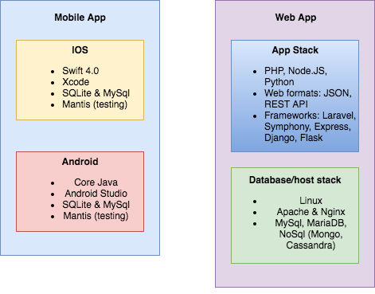

# Present Education — Technical Architecture

This document covers the architecture of the Present platform as built in 2018–2019.
Stack, key design decisions, how the real-time lock mechanic worked, and what we'd
architect differently today.

---

## Stack Overview

<p align="center">
  
</p>

| Layer | Technology |
|-------|-----------|
| iOS client | Swift (Xcode) |
| Android client | Java |
| Teacher web dashboard | Angular (TypeScript) |
| Backend API + real-time | Node.js + Express + Socket.io |
| Database | MongoDB (via Mongoose) |
| Push notifications | Firebase Cloud Messaging (FCM) |
| Hosting | AWS |
| Code repository | BitBucket |
| API documentation | Swagger |

---

## Application Flow

<p align="center">
  
</p>

---

## The Lock Mechanic: How It Actually Worked

The core technical challenge was this: lock third-party apps on student-owned
phones in real time, across hundreds of devices simultaneously, without requiring
district-managed hardware. Here's how we solved it on each platform.

### Android

Android's **Accessibility Service API** was the mechanism. At install time, the
app registered `WindowChangeDetectingService` as an accessibility service. This
service received an `onAccessibilityEvent` callback whenever the user attempted
to switch to another application.

When a student's device was in locked state:
1. Any attempt to open a non-whitelisted app triggered `onAccessibilityEvent`
2. The service detected the foreground app change
3. Present was immediately brought back to foreground
4. The student saw the Present app — not the app they tried to open

```
Student tries to open Instagram
         │
         ▼
WindowChangeDetectingService.onAccessibilityEvent()
         │
         ├── Is device locked? YES
         │         │
         │         ▼
         │   Bring Present to foreground
         │   (Instagram never appears)
         │
         └── Is device locked? NO
                   │
                   ▼
             Allow app switch
```

**The fragility:** Samsung devices layer Samsung One UI on top of Android, which
interfered with the accessibility service in unpredictable ways. Pixel devices
worked reliably; Samsung — the most common device in our pilot — did not.

**Offline resilience:** A separate `WifiReceiver` listener monitored network
connectivity. If the socket connection dropped mid-class, the device unlocked
rather than leaving a student trapped. Lock state was persisted locally in SQLite
so the device could re-sync when connectivity was restored.

### iOS

iOS's sandboxing made true app locking significantly harder. We used **Guided
Access** (Apple's supervised mode feature) — but this required students to
enable it manually on their own device. In a district MDM enrollment, the IT
department could configure this at scale. For BYOD (our use case), we were
asking each student to configure it individually.

This was a problem we never fully solved. An MDM-based approach would have
required district IT involvement — a 6-month process per school. We had designed
for BYOD and were fighting the OS to get there.

---

## Real-Time Architecture: Socket.io

Lock/unlock events needed to propagate from the teacher's browser to 30 student
phones within 1–2 seconds. We used **Socket.io** (Node.js) with two namespaces:

```
Teacher Dashboard (browser)          Backend (Node.js + Socket.io)
        │                                        │
        │  emit("toggleLockAll")  ──────────►   │
        │                                        │  student namespace
        │                                        │  ├── emit("lock") ──► Student A
        │                                        │  ├── emit("lock") ──► Student B
        │                                        │  └── emit("lock") ──► Student C...
        │
        │  ◄── emit("attendanceUpdate")  ─────── │  (as students mark present)
```

**Teacher namespace:** Handles teacher dashboard connections, receives lock/unlock
commands, broadcasts attendance and IDGI updates back to the teacher.

**Student namespace:** Maintains persistent connections to all enrolled student
devices. Receives lock/unlock events from the backend and applies them.

On the Android client, `LockActivities.java` managed the socket connection state:
- `ifConnect`: socket connected handler
- `ifDisconnect`: socket lost handler → triggers local unlock
- `onLock` / `onEmitUnlock`: lock state change handlers

On iOS, `SocketController.swift` managed the connection. `SocketListeners.swift`
handled incoming lock/unlock events. `SocketEmit.swift` handled outbound status
reporting.

---

## Push Notifications: Firebase Cloud Messaging

Socket.io handled in-session real-time communication. **Firebase Cloud Messaging
(FCM)** handled the case where a student's app was in the background or closed
when class started.

**Android flow:**
1. `MyFireBaseInstanceService.java` retrieves the device token on first launch
2. Token is sent to the backend during registration
3. When teacher starts class: backend emits via socket (if app is foreground)
   OR sends FCM push notification (if app is background)
4. `MyFireBaseMessagingService.java` receives the push, prompts student to open Present

**iOS flow:** `AppDelegate.swift` configured Firebase on launch. Push notifications
followed the same foreground/background branching logic.

---

## Registration Flow

Registration was admin-initiated, not self-service:

```
1. Admin enters student/teacher school email + name in admin dashboard
   └── Student/teacher record created in MongoDB

2. System sends email with setup link

3. Student/teacher clicks link → lands on profile completion page
   └── Enters name, creates password

4. On first login: schedule is auto-populated from LMS integration

5. Device registration:
   └── App sends device token + phone type to backend
   └── Backend stores token for FCM targeting
   └── Socket connection established
```

This admin-gated flow was intentional — it meant no student could join a class
without the teacher explicitly adding them. The tradeoff: any error in the admin's
email list (typos, outdated addresses) created friction at onboarding.

---

## Three-Tier Database Model

MongoDB held three conceptually distinct data stores:

| Store | Contents | Purpose |
|-------|----------|---------|
| **Lock DB** (local SQLite) | Current lock state per device | Offline-first resilience |
| **LMS credentials store** | Canvas/Google Classroom OAuth tokens | Roster sync |
| **User identity DB** | Accounts, device tokens, class enrollment | Core application data |

The local SQLite layer on each device was the offline-first mechanism. Lock state
was written locally on every change, so a dropped connection didn't create an
inconsistent state that the device couldn't recover from.

---

## LMS Integrations

The admin dashboard supported five roster import methods:

| Integration | Method |
|------------|--------|
| Google Classroom | OAuth 2.0 |
| Canvas | API key |
| Clever | District SSO |
| Schoology | API |
| Manual | CSV upload |

In the Lincoln High School pilot, roster management was primarily done via CSV
import. Google Classroom integration was available but not used by the pilot teachers.

---

## Security Model

**At the API layer:**
- Token-based authentication for all API calls
- Device tokens generated at registration, used to target FCM messages
- Socket namespaces authenticated via token at connection time

**Data privacy considerations (FERPA / COPPA):**
- Student data (name, school email, attendance, learning check responses) stored
  in AWS-hosted MongoDB
- Portland Public Schools completed a full IRIS (IT security) review before pilot
- Parent opt-out forms provided
- No student home addresses, SSNs, or financial data collected
- Emergency contact stored on-device; not transmitted unless accessed

**Planned controls (not fully implemented before shutdown):**
- Logical data separation per school district
- Nightly backups
- Staging / production environment separation
- Annual third-party security audit

---

## What We'd Architect Differently Today

### 1. Replace Accessibility Service with a background service / MDM SDK

The Accessibility Service approach was fragile by design — it's an API meant for
accessibility tools, not app management. Today we'd use **Android Enterprise /
Managed Configurations** or partner with an MDM SDK that provides sanctioned
app-management APIs. For iOS, **Apple School Manager + MDM** is now much more
accessible for smaller schools than it was in 2018.

### 2. Firebase Realtime Database or Supabase instead of Socket.io

Managing persistent WebSocket connections at scale is operationally complex.
Firebase Realtime DB (or Supabase's real-time subscriptions) would give us the
same sub-second propagation with significantly less infrastructure to manage.
The student client would subscribe to a lock-state document; the teacher's action
would write to it; devices would react.

### 3. Separate the lock enforcement from the UI

In our architecture, the same app that showed the student UI also enforced the
lock. These should be separate: a background service that enforces lock state
(which the student can't easily kill) and a UI layer on top. Android's foreground
service + WorkManager would be the right approach now.

### 4. Offline-first from the ground up, not bolted on

Our SQLite local store was added to handle connectivity drops, not designed in
from the start. Today we'd use a proper offline-first framework (PouchDB / RxDB
on the web side, Room on Android, CoreData + CloudKit on iOS) with sync as the
primary model, not connectivity as the assumption.

### 5. Start with MDM

With six years of hindsight: the BYOD approach was the wrong constraint to accept.
MDM-enrolled devices give you real, sanctioned, Apple/Google-approved control over
app accessibility. The setup friction per school is higher, but the product
reliability is orders of magnitude better. We should have targeted MDM-enrolled
1:1 device programs from day one, even if it narrowed our addressable market.

---

*Present Education Inc., 2018–2019. Architecture implemented by AppInventiv (Pune, India).*
